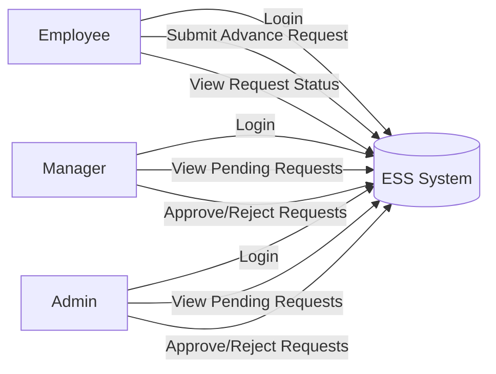
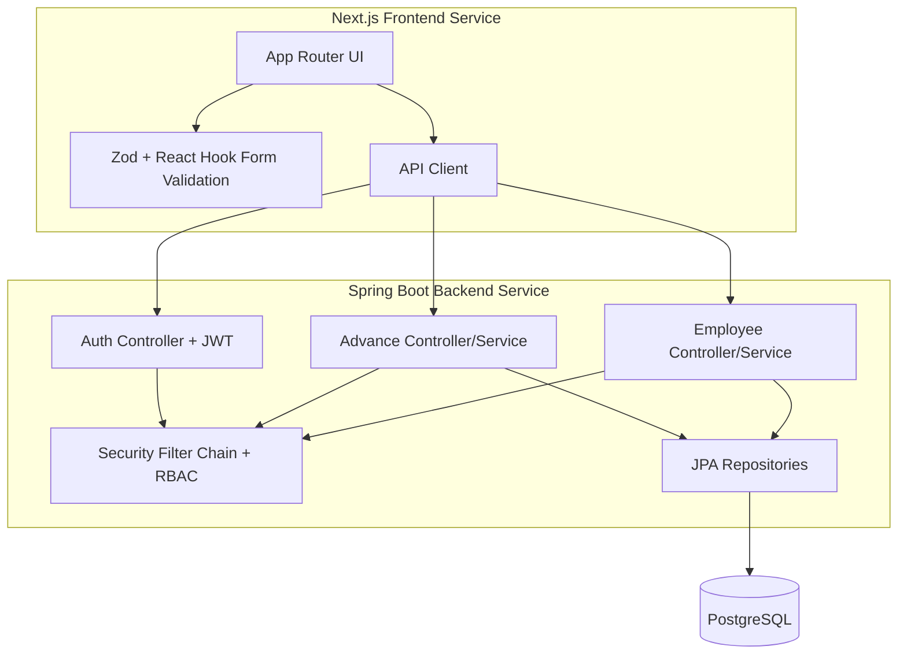
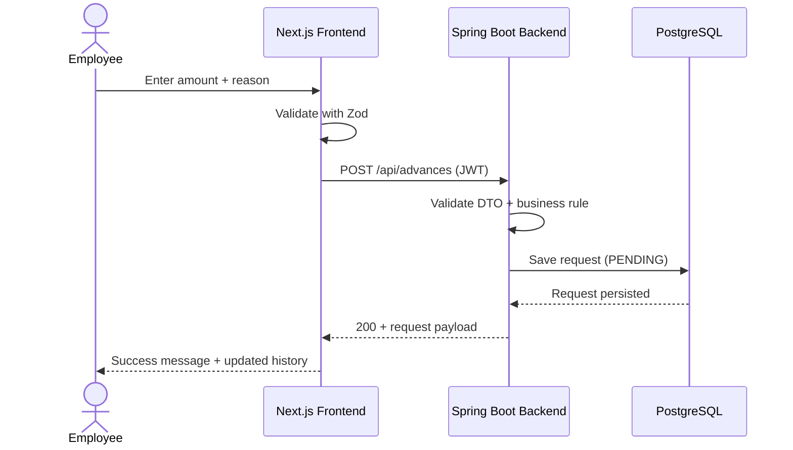
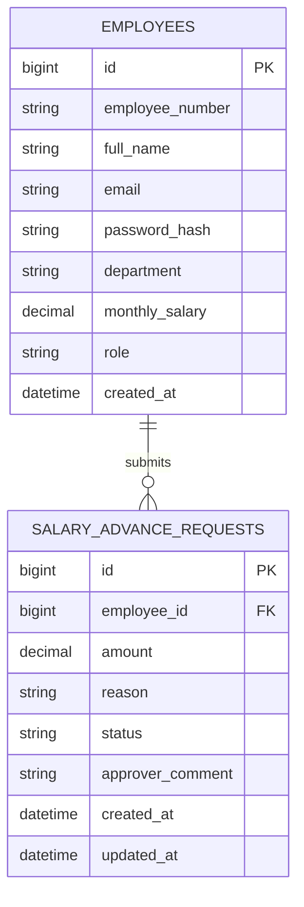

# System Design Diagrams

## 1. Use Case Diagram

```mermaid
flowchart LR
  E[Employee]
  M[Manager]
  A[Admin]
  S[(ESS System)]

  E -->|Login| S
  E -->|Submit Advance Request| S
  E -->|View Request Status| S

  M -->|Login| S
  M -->|View Pending Requests| S
  M -->|Approve/Reject Requests| S

  A -->|Login| S
  A -->|View Pending Requests| S
  A -->|Approve/Reject Requests| S
```

## 2. Component Diagram

```mermaid
flowchart TB
  subgraph Frontend[Next.js Frontend Service]
    UI[App Router UI]
    VAL[Zod + React Hook Form Validation]
    APIClient[API Client]
  end

  subgraph Backend[Spring Boot Backend Service]
    AUTH[Auth Controller + JWT]
    ADV[Advance Controller/Service]
    EMP[Employee Controller/Service]
    SEC[Security Filter Chain + RBAC]
    REPO[JPA Repositories]
  end

  DB[(PostgreSQL)]

  UI --> VAL
  UI --> APIClient
  APIClient --> AUTH
  APIClient --> ADV
  APIClient --> EMP
  AUTH --> SEC
  ADV --> SEC
  EMP --> SEC
  ADV --> REPO
  EMP --> REPO
  REPO --> DB
```

## 3. Sequence Diagram (Submit Request)

```mermaid
sequenceDiagram
  actor Employee
  participant FE as Next.js Frontend
  participant BE as Spring Boot Backend
  participant DB as PostgreSQL

  Employee->>FE: Enter amount + reason
  FE->>FE: Validate with Zod
  FE->>BE: POST /api/advances (JWT)
  BE->>BE: Validate DTO + business rule
  BE->>DB: Save request (PENDING)
  DB-->>BE: Request persisted
  BE-->>FE: 200 + request payload
  FE-->>Employee: Success message + updated history
```

## 4. ER Diagram

```mermaid
erDiagram
  EMPLOYEES ||--o{ SALARY_ADVANCE_REQUESTS : submits

  EMPLOYEES {
    bigint id PK
    string employee_number
    string full_name
    string email
    string password_hash
    string department
    decimal monthly_salary
    string role
    datetime created_at
  }

  SALARY_ADVANCE_REQUESTS {
    bigint id PK
    bigint employee_id FK
    decimal amount
    string reason
    string status
    string approver_comment
    datetime created_at
    datetime updated_at
  }
```
