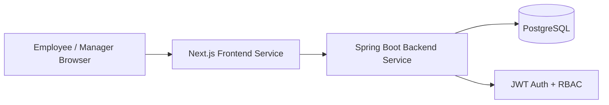

# Employee Self Service Salary Advance System

## 1. Project Title
Employee Self Service Salary Advance System (ESS-SA)

## 2. Problem Statement
Many organizations process salary advance requests manually through email and paper forms. This causes delays, weak audit trails, poor visibility, and inconsistent approval decisions.

## 3. Aim and Objectives
### Aim
Build a secure and scalable web-based Employee Self Service platform for salary advance requests and approvals.

### Objectives
- Provide employee self-service request submission.
- Implement manager/admin approval workflow.
- Enforce financial and data validation rules.
- Provide real-time request status tracking.
- Deploy using containerized microservices.

## 4. Stakeholders
- Employees
- Managers/Approvers
- HR Officers
- Payroll Team
- System Administrators
- Organization Leadership

## 5. Requirements Analysis
### Business Requirements
- Reduce salary advance turnaround time by 60%.
- Maintain full auditability of request lifecycle.
- Enforce consistent policy rules.

### User Requirements
- Employees can create and track requests.
- Managers can review pending requests quickly.
- Admin can observe all requests.

## 6. SRS
Detailed Software Requirements Specification is provided in `docs/SRS.md`.

## 7. Software Effort Estimation
### Technique Selected
Use Case Points (UCP).

### Why Selected
- The system is workflow-driven (login, submit request, review/decision, reporting).
- Use cases are clear and map well to UCP complexity factors.
- Better for early-stage sizing than detailed function counting.

### Estimated Effort
- Unadjusted actor weight: 9
- Unadjusted use case weight: 70
- UCP: 79
- Productivity factor: 20 person-hours/UCP
- Estimated effort: 1,580 person-hours

### Estimated Duration
- Team size assumption: 4 developers
- Weekly capacity: 4 x 35 = 140 hours/week
- Duration: 1,580 / 140 = 11.3 weeks (rounded to 12 weeks)

### Assumptions
- Stable requirements after sprint 2.
- Team has Spring Boot + Next.js experience.
- Existing CI/CD tooling available.

### Constraints
- Time-boxed academic version uses simplified payroll integration.
- No external identity provider in v1.

### Scope Influence
- Deferred advanced analytics/reporting.
- Implemented core workflow and policy enforcement first.

## 8. System Analysis
- Existing process is manual, low transparency, high latency.
- Proposed system introduces API-first workflow with policy checks.

## 9. System Design
### Architecture
- Frontend microservice: Next.js (UI + validation)
- Backend microservice: Spring Boot REST API
- Data layer: PostgreSQL

### Use Cases
- Login
- Submit salary advance request
- View personal request history
- Review pending requests
- Approve/reject with comments

### Data Model
- Employee (role, salary, credentials)
- SalaryAdvanceRequest (amount, reason, status, comments, timestamps)

### Mermaid Architecture Diagram

Detailed design artifacts are in `docs/Design_Diagrams.md`.

## 10. Implementation
Implemented as a functional application with:
- Frontend, backend, database
- JWT authentication
- Role-based authorization
- Input validation (frontend + backend)
- Error handling
- Security controls
- Responsive UI

## 11. Testing
Detailed testing report in `docs/Testing_Report.md`.

## 12. Technical Debt
Detailed technical debt register in `docs/Technical_Debt_Plan.md`.

## 13. Deployment
- Containerized deployment using Docker Compose.
- Cloud deployment guide included in `docs/Deployment_and_Source_Links.txt`.

## 14. User Manual
Detailed user manual in `docs/User_Manual.md`.

## 15. Maintenance Strategy
### Corrective
- Bug triage and patch releases weekly.

### Adaptive
- Policy rule updates with feature flags.

### Perfective
- UX and workflow improvements based on user feedback.

### Preventive
- Dependency and vulnerability updates monthly.

## 16. Future Evolution
- Integrate with payroll APIs.
- Introduce multi-level approvals.
- Add reporting dashboard and exports.
- Enable SSO with enterprise identity provider.

## 17. Limitations
- No direct payroll disbursement in v1.
- Simplified RBAC and notification workflow.

## 18. Conclusion
The solution addresses the core salary advance workflow with secure, validated, and auditable processing using a modern microservice architecture.

## 19. References
- Spring Boot Official Documentation
- Next.js Official Documentation
- PostgreSQL Official Documentation
- OWASP ASVS and Top 10
